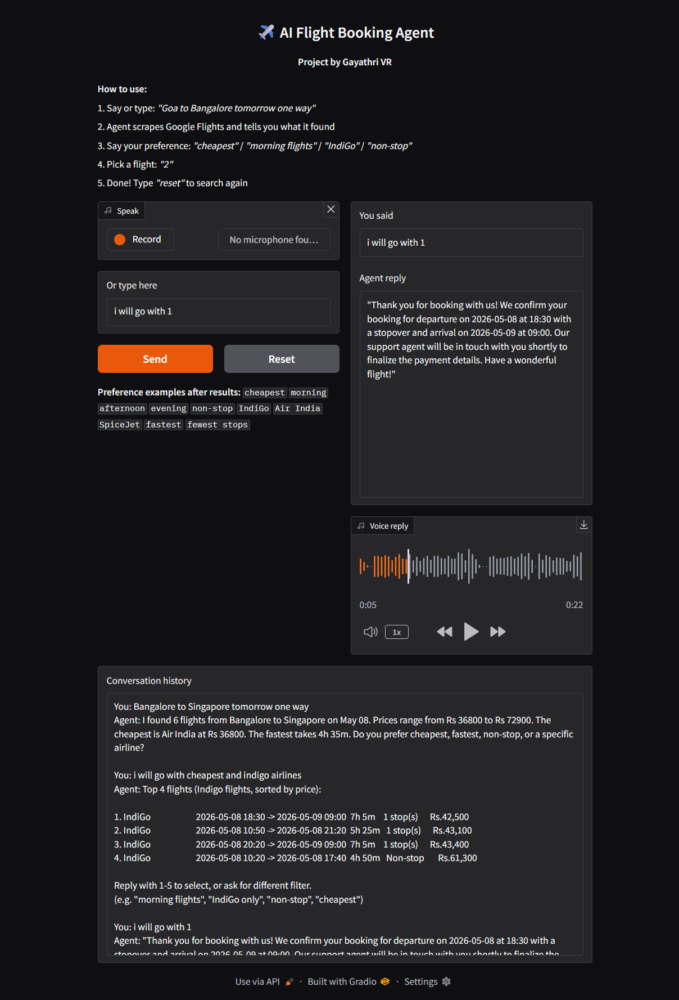

✈️ Flight AI — Multimodal AI Flight Booking Agent (Whisper + LLaMA + Google Flights Scraper)

An intelligent end-to-end AI-powered flight booking assistant that allows users to search, filter, and select flights using voice or text input. The system integrates LLMs, speech recognition (Whisper), web scraping, and a Gradio UI to simulate a real-world travel booking experience.

🚀 Overview

Flight AI is a multimodal AI-powered flight booking assistant that lets users:

🎤 Speak or type travel requests
✈️ Search real-time flight data
🧠 Use natural language to filter flights
💬 Chat with an AI travel agent
🔊 Receive voice responses

It simulates a real conversational flight booking experience using LLMs + live flight data.

🎬 Demo

▶ Demo Video: demo_flightAI.mp4

🖼️ UI Preview

📖 Story Behind This Project

This project started with a simple idea:

“Can I build an AI that books flights like a real travel agent?”

I wanted users to speak naturally:

“Goa to Bangalore tomorrow one way”

and get:

flight search
comparison
recommendation
booking flow

❌ The Problem

There was no usable flight API:

    * Google Flights API → discontinued
      RapidAPI → limited & expensive
      Amadeus API → restricted access
      Playwright scraping → slow & unstable

So the core challenge was:

No reliable way to get real-time flight data.

💡 The Breakthrough

Instead of scraping UI, I discovered:

👉 https://github.com/AWeirdDev/flights

This project:

    builds Google Flights query URLs
    extracts structured flight data
    avoids browser automation

This became the backbone of the system.

🔧 What I Built on Top

I modified and extended the scraper for my AI system:

✅ My Improvements
        
      Added city → IATA mapping system
      Integrated Google Drive caching for Colab
      Added robust retry system
      Fixed datetime parsing issues
      Structured output for LLM consumption
      Converted raw flight objects → clean DataFrame
✨ Modified Scraper Behavior

Instead of raw scraping, my system:

scrape("Mumbai", "Delhi", "2026-05-08")

Internally becomes:

     Convert city → IATA (BOM → DEL)
     Build query using fast-flights
     Fetch structured results
     Normalize:
     price
     duration
     stops
     airline
     Cache CSV to Drive
     Return clean dataset to LLM

---
## 📁 Project Structure

## 🧪 Tech Stack

- 🧠 LLaMA 3.2 (Intent + reasoning)
- 🎤 Whisper (Speech recognition)
- ✈️ fast-flights (Google Flights scraper backend)
- 📊 Pandas (data processing)
- 🔊 gTTS (speech output)
- 🎛 Gradio (UI)

---

⚠️ Limitations
       
    Google Flights structure may change
    Scraping depends on third-party library stability
    No real payment/booking API integrated yet

🔮 Future Improvements
    
    Real Booking System
    🧠 Smarter AI Agent
       Tool-calling LLM agent
       Personalized recommendations
    🌐 Production Version
       React frontend
       Mobile app
       Cloud deployment (HuggingFace / AWS)

📌 Conclusion

FlightAI demonstrates how:

    “Modern LLMs + smart scraping + lightweight UI = real-world AI products”

It bridges:

    AI reasoning 🤖
    Real-time data ✈️
    Voice interaction 🎤
